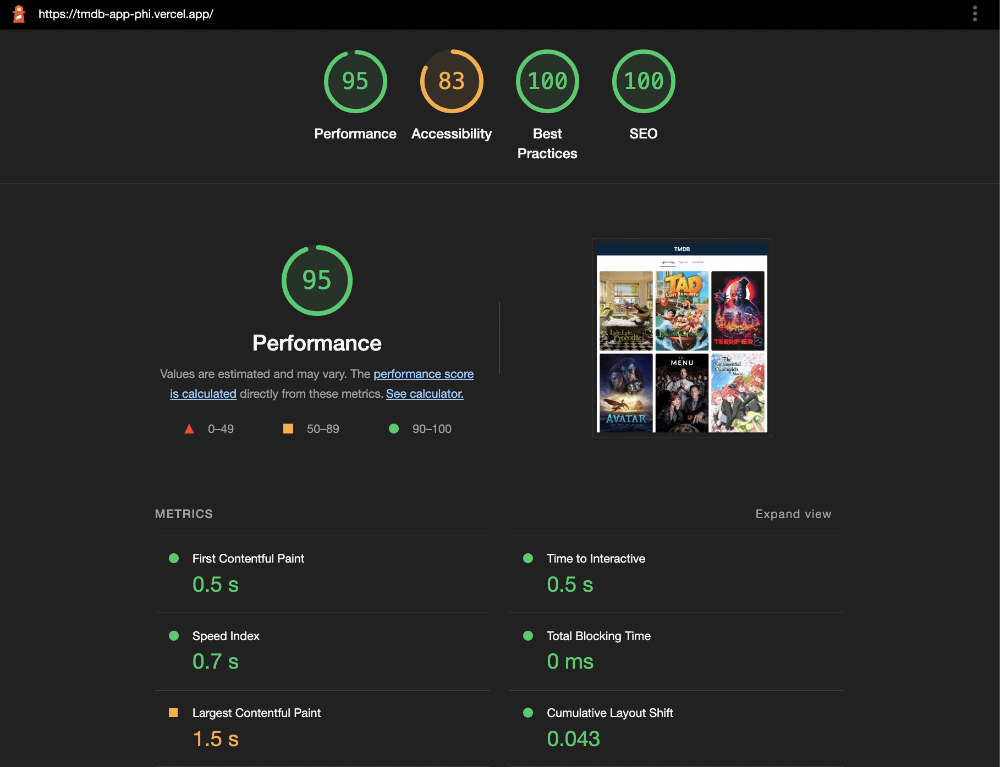

# TMDB App

This is The Movie Database web app using [TMDB](https://developers.themoviedb.org/3) REST API

Features:

- Movie list page
  - Filter by upcoming, popular, top rated
  - Pagination
- Movie detail page
  - details, overview, image
  - cast
  - trailer

## Preview

Live Site URL: [Preview](https://tmdb-app-phi.vercel.app/)

## Getting Started

First, run the development server:

```bash
npm run dev
# or
yarn dev
```

add your TMDB_API_KEY to `.env`

Open [http://localhost:3000](http://localhost:3000) with your browser to see the result.

## Built with

- Framework: NextJs, React
- Css Library: Emotion, Geist UI
- Fetching Library: SWR

## Lighthouse



## Author

- Website - [Fauzan Rianda](https://fauzanr.github.io)
- Linkedin - [Fauzan Rianda](https://www.linkedin.com/in/fauzanr/)
  .
